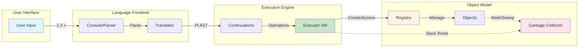
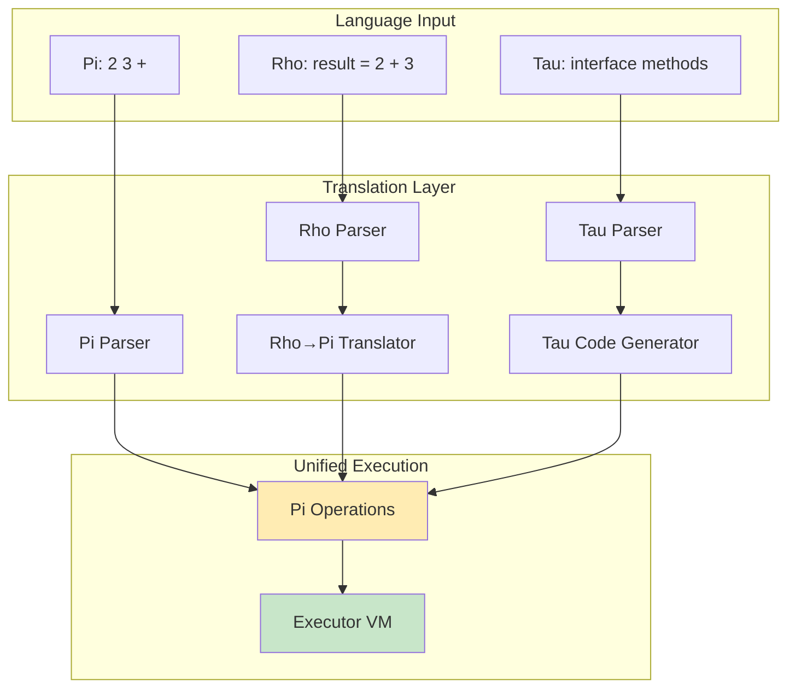
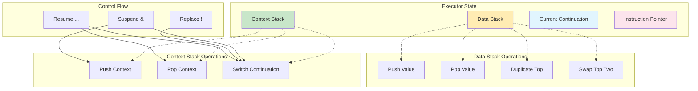
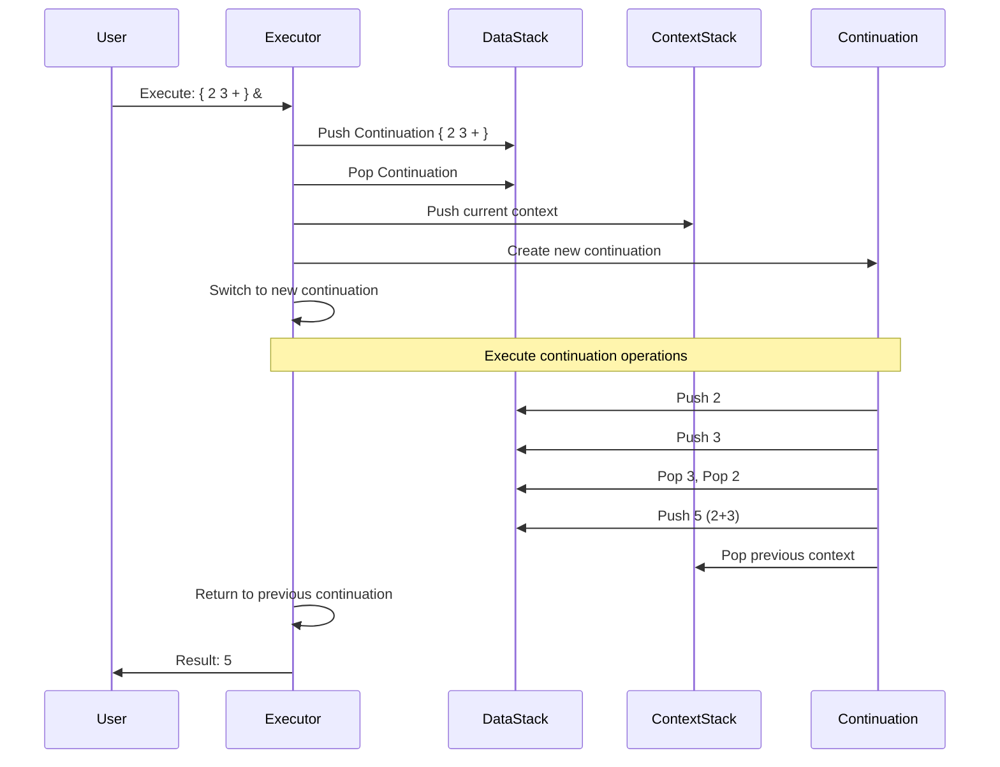
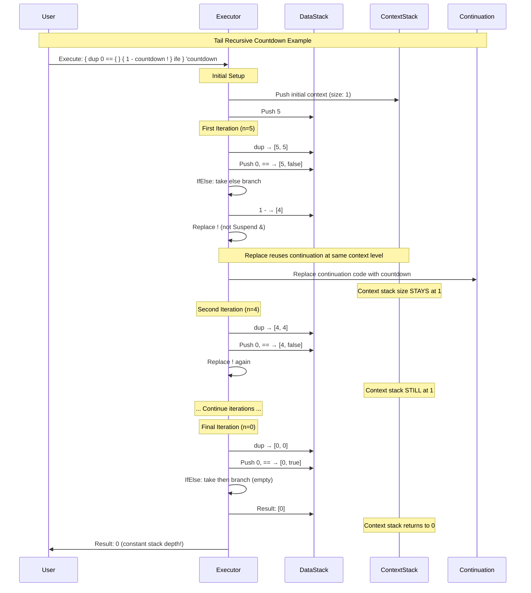

# KAI Executor - Virtual Machine

The KAI Executor is a stack-based virtual machine that serves as the execution engine for all KAI languages (Pi, Rho, and Tau). It provides a unified execution model where all language constructs are ultimately translated into Pi operations and executed in a consistent, predictable manner.

## Overview

The Executor is KAI's virtual machine, responsible for:

- **Stack-based execution**: Managing data and context stacks for operation execution
- **Language-agnostic processing**: All languages compile down to Pi operations
- **Continuation management**: First-class support for continuations and closures
- **Memory integration**: Seamless integration with KAI's garbage collector
- **Network transparency**: Execution can span across network boundaries
- **Error handling**: Comprehensive exception handling and stack trace generation

## Architecture

The Executor follows a clean separation of concerns in the KAI language pipeline:



### Language Pipeline Flow



### Core Components

1. **Console** - Handles user interaction and passes input to the Translator
2. **Translator** - Converts language-specific syntax to Continuations
3. **Executor** - Executes Continuations in a language-agnostic manner
4. **Registry** - Provides object creation and type management services

All languages (Pi, Rho, Tau) are ultimately translated into Pi operations, which are then executed by the Executor. This architecture ensures that the Executor only needs to handle Pi operations, simplifying the codebase and improving maintainability.

## Stack-Based Execution Model

The Executor maintains two primary stacks that work together to provide a complete execution environment:



### Data Stack
- **Purpose**: Contains values being operated on
- **Operations**: Push, pop, manipulate data values
- **Content**: Numbers, strings, objects, references
- **Example**: `2 3 +` pushes 2, pushes 3, then pops both and pushes 5

### Context Stack
- **Purpose**: Manages execution flow and continuations
- **Operations**: Function calls, returns, exception handling
- **Content**: Continuations, return addresses, exception handlers
- **Example**: Function calls push return context, `&` pops and executes continuations

### Execution Flow with Continuations



```cpp
class Executor {
    Stack<Value> data_stack_;      // Data values and objects
    Stack<Context> context_stack_; // Execution contexts and continuations
    Registry* registry_;           // Object factory and type system
    
public:
    // Core execution interface
    void Execute(Continuation* continuation);
    void Push(const Value& value);
    Value Pop();
    
    // Stack manipulation
    void Dup();   // Duplicate top of data stack
    void Swap();  // Exchange top two data stack items
    void Drop();  // Remove top of data stack
    void Over();  // Copy second item to top
};
```

## Core Operations

The Executor implements a comprehensive set of Pi operations:

### Stack Manipulation Operations
```cpp
// Basic stack operations
Dup    // Duplicate top of stack: [a] → [a, a]
Swap   // Swap top two: [a, b] → [b, a]  
Drop   // Remove top: [a, b] → [a]
Over   // Copy second to top: [a, b] → [a, b, a]
Depth  // Push stack depth: [a, b, c] → [a, b, c, 3]
Clear  // Empty the stack: [a, b, c] → []
```

### Arithmetic Operations
```cpp
Plus     // Addition: [a, b] → [a + b]
Minus    // Subtraction: [a, b] → [a - b]  
Multiply // Multiplication: [a, b] → [a * b]
Divide   // Division: [a, b] → [a / b]
Modulo   // Remainder: [a, b] → [a % b]
```

### Logical Operations
```cpp
And      // Logical AND: [a, b] → [a && b]
Or       // Logical OR: [a, b] → [a || b]
Not      // Logical NOT: [a] → [!a]
Xor      // Exclusive OR: [a, b] → [a ^ b]
```

### Comparison Operations
```cpp
Equiv     // Equality: [a, b] → [a == b]
NotEquiv  // Inequality: [a, b] → [a != b]
Less      // Less than: [a, b] → [a < b]
Greater   // Greater than: [a, b] → [a > b]
LessOrEquiv    // Less or equal: [a, b] → [a <= b]
GreaterOrEquiv // Greater or equal: [a, b] → [a >= b]
```

### Variable Operations
```cpp
Store    // Store value: [value, 'name] → [], stores value in registry
Retrieve // Retrieve value: ['name] → [value], fetches from registry
```

### Control Flow Operations
```cpp
IfElse     // Conditional: [then-branch, else-branch, condition] → executes branch
WhileLoop  // Loop: [body, condition] → executes while condition true
ForLoop    // Iterate: [body, end, start] → executes body for range
Continue   // Continuation execution: [continuation] → executes continuation
```

### Continuation Operations
```cpp
Execute (&)  // Execute continuation: [continuation] → result
Suspend      // Pause execution and switch context
Resume       // Return to suspended context
Replace      // Replace current continuation with new one
```

## Continuation System

Continuations are first-class objects in the Executor, representing executable code blocks:

```cpp
class Continuation {
    std::vector<Operation> operations_;  // Sequence of Pi operations
    Registry* registry_;                 // Associated registry
    
public:
    void Execute(Executor* executor);
    void AddOperation(Operation op);
    size_t GetOperationCount() const;
};
```

### Continuation Creation and Execution
```pi
// Create continuation
{ 2 3 + }        // Creates continuation with operations: Push(2), Push(3), Add

// Execute continuation  
{ 2 3 + } &      // Pushes continuation, then executes it → result: 5

// Store and reuse continuations
{ dup * } 'square #    // Store squaring continuation
5 'square @ &          // Load and execute → result: 25
```

### Advanced Continuation Control
```pi
// Suspend: Pause current execution, switch to new continuation
{ "Side task" trace } suspend   // Execute side task, return later

// Resume: Exit current continuation, return to suspended one
{ "Done" trace resume } &       // Execute and exit immediately

// Replace: Completely substitute current continuation
{ "New path" trace } replace    // Change execution flow permanently
```

### Tail Recursion with Replace

The Replace operation (`!`) enables efficient tail call optimization by replacing the current continuation instead of pushing a new one. This keeps the context stack size constant:



**Key Difference: Replace vs Suspend**

```mermaid
graph TB
    subgraph "Using Replace (Tail Call) !"
        R1[Context Stack: 1]
        R2[Call countdown]
        R3[Replace continuation]
        R4[Context Stack: 1]
        R5[Execute new iteration]
        R6[Context Stack: 1]

        R1 --> R2 --> R3 --> R4 --> R5 --> R6

        style R1 fill:#c8e6c9
        style R4 fill:#c8e6c9
        style R6 fill:#c8e6c9
    end

    subgraph "Using Suspend (Regular Call) &"
        S1[Context Stack: 1]
        S2[Call countdown]
        S3[Push new context]
        S4[Context Stack: 2]
        S5[Call countdown again]
        S6[Push new context]
        S7[Context Stack: 3]

        S1 --> S2 --> S3 --> S4 --> S5 --> S6 --> S7

        style S1 fill:#c8e6c9
        style S4 fill:#ffeb3b
        style S7 fill:#ff5252
    end
```



**Tail Recursion Example - Factorial with Accumulator**:
```pi
// Non-tail recursive (grows stack)
{ dup 0 == { drop 1 } { dup 1 - fact & * } ife } 'fact #
5 fact & // Stack grows: 1 → 2 → 3 → 4 → 5 → 4 → 3 → 2 → 1

// Tail recursive with accumulator (constant stack)
{ swap dup 0 == { drop } { swap over * swap 1 - swap fact ! } ife } 'fact #
5 1 fact & // Stack stays constant at depth 1, result: 120
```

## Memory Management Integration

The Executor integrates seamlessly with KAI's garbage collector:

```cpp
class Executor {
    void MarkObjects() {
        // Mark all objects on data stack as reachable
        for (auto& value : data_stack_) {
            if (value.IsObject()) {
                value.GetObject()->MarkGray();
            }
        }
        
        // Mark all continuations on context stack
        for (auto& context : context_stack_) {
            context.continuation->MarkGray();
        }
    }
};
```

**Benefits:**
- **Automatic cleanup**: Objects are automatically collected when unreachable
- **Cycle handling**: Circular references in continuations are properly handled
- **Low overhead**: GC integration adds minimal execution overhead
- **Deterministic behavior**: Memory usage patterns are predictable

## Error Handling and Debugging

The Executor provides comprehensive error handling and debugging capabilities:

### Exception Handling
```cpp
class ExecutorException : public std::exception {
    std::string message_;
    std::vector<std::string> stack_trace_;
    
public:
    const char* what() const noexcept override;
    const std::vector<std::string>& GetStackTrace() const;
};
```

### Stack Trace Generation
```pi
// Example that generates stack trace on error
{ 
    { 1 0 / } 'divide_by_zero #
    'divide_by_zero @ &
} 'test_function #

'test_function @ &  // Generates stack trace: test_function → divide_by_zero → Division
```

### Debugging Operations
```cpp
Trace    // Print value without consuming it: [value] → [value] (with output)
Assert   // Validate condition: [condition, message] → [] or exception
Debug    // Enter debug mode with stack inspection
StackDump // Print entire stack contents for debugging
```

## Performance Characteristics

The Executor is designed for high performance:

### Operation Speed
- **Simple operations**: ~10-50 CPU cycles per operation
- **Function calls**: ~100-200 cycles including context switch
- **Object creation**: ~500-1000 cycles including registry lookup
- **Garbage collection**: Incremental, ~1-5% execution overhead

### Memory Usage
- **Stack overhead**: ~8-16 bytes per stack entry
- **Context overhead**: ~32-64 bytes per function call
- **Continuation storage**: ~16-32 bytes + operation storage
- **Total overhead**: Typically <5% of application memory

### Optimization Techniques
- **Operation inlining**: Simple operations compiled to minimal code
- **Stack caching**: Frequently accessed stack entries cached in registers
- **Continuation pooling**: Reuse continuation objects to reduce allocation
- **Type specialization**: Optimized code paths for common data types

## Network Integration

The Executor supports distributed execution across network boundaries:

```cpp
// Network-aware execution
class NetworkExecutor : public Executor {
    void ExecuteRemote(NetworkNode* node, Continuation* continuation);
    void HandleRemoteCall(const RemoteCallMessage& message);
    void SendResult(NetworkNode* node, const Value& result);
};
```

### Distributed Execution Model
- **Transparent execution**: Operations can execute on remote nodes
- **Result synchronization**: Automatic result marshaling and return
- **Error propagation**: Exceptions properly propagated across network
- **Load balancing**: Automatic distribution of work across available nodes

## Language Integration

The Executor seamlessly integrates with all KAI languages:

### Pi Integration
```pi
// Direct Pi execution - native operations
2 3 + dup *    // Push 2, push 3, add, duplicate, multiply → 25
```

### Rho Integration  
```rho
// Rho compiles to Pi operations
fun square(x) {          // Translates to Pi continuation
    return x * x         // Becomes: x @ dup * 
}
result = square(5)       // Becomes: 5 'square @ &
```

### Tau Integration
```tau
// Tau generates code that uses Executor
interface Calculator {
    float add(float a, float b);  // Generates proxy/agent code
}
// Generated code uses Executor for method dispatch
```

## Usage Examples

### Basic Execution
```cpp
// Create executor with registry
auto registry = Registry::Create();
auto executor = std::make_unique<Executor>(registry.get());

// Execute simple Pi operations
auto continuation = CreateContinuation("2 3 + dup *");
executor->Execute(continuation.get());

auto result = executor->Pop();  // Result: 25
```

### Advanced Continuation Usage
```cpp
// Create and store reusable continuation
auto square_cont = CreateContinuation("{ dup * }");
registry->Store("square", square_cont);

// Use stored continuation
executor->Push(Value(7));
auto stored_cont = registry->Retrieve("square");
executor->Execute(stored_cont.GetContinuation());

auto result = executor->Pop();  // Result: 49
```

### Error Handling
```cpp
try {
    auto dangerous_cont = CreateContinuation("1 0 /");
    executor->Execute(dangerous_cont.get());
} catch (const ExecutorException& ex) {
    std::cout << "Error: " << ex.what() << std::endl;
    for (const auto& frame : ex.GetStackTrace()) {
        std::cout << "  at " << frame << std::endl;
    }
}
```

## Debugging and Profiling

The Executor provides extensive debugging capabilities:

### Interactive Debugging
```cpp
// Enable debug mode
executor->SetDebugMode(true);

// Step through execution
executor->StepInto();   // Execute one operation
executor->StepOver();   // Execute until next statement
executor->Continue();   // Resume normal execution

// Inspect state
auto stack_contents = executor->GetDataStack();
auto call_stack = executor->GetContextStack();
```

### Performance Profiling
```cpp
// Enable profiling
executor->EnableProfiling(true);

// Execute code
executor->Execute(continuation.get());

// Get performance metrics
auto stats = executor->GetProfilingStats();
std::cout << "Operations executed: " << stats.operation_count << std::endl;
std::cout << "Execution time: " << stats.execution_time_ms << "ms" << std::endl;
std::cout << "Memory allocated: " << stats.memory_allocated << " bytes" << std::endl;
```

## Advanced Features

### Custom Operations
```cpp
// Define custom operation
class CustomMultiply : public Operation {
public:
    void Execute(Executor* executor) override {
        auto b = executor->Pop();
        auto a = executor->Pop();
        executor->Push(Value(a.GetNumber() * b.GetNumber() * 2)); // Double multiplication
    }
};

// Register custom operation
executor->RegisterOperation("double_multiply", std::make_unique<CustomMultiply>());
```

### Event System Integration
```cpp
// Subscribe to execution events
executor->GetEventSystem()->Subscribe<OperationExecutedEvent>(
    [](const OperationExecutedEvent& event) {
        std::cout << "Executed: " << event.operation_name << std::endl;
    });
```

## See Also

- **[Pi Language Documentation](../Language/Pi/README.md)** - Stack-based language reference
- **[Rho Language Documentation](../Language/Rho/README.md)** - Infix language that compiles to Pi
- **[Core System Documentation](../Core/README.md)** - Registry and object model
- **[Memory Management Guide](../../Doc/MemoryManagement.md)** - Garbage collection details
- **[Network Architecture](../../Doc/NetworkArchitecture.md)** - Distributed execution
- **[Performance Tuning Guide](../../Doc/PerformanceTuning.md)** - Optimization techniques

The Executor serves as the beating heart of the KAI system, providing fast, reliable, and feature-rich execution of all KAI languages while maintaining simplicity through its unified Pi-based execution model.