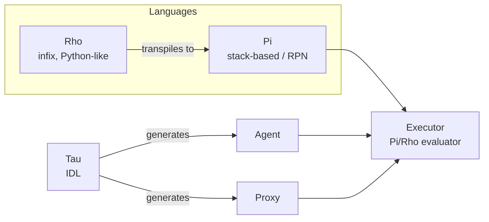
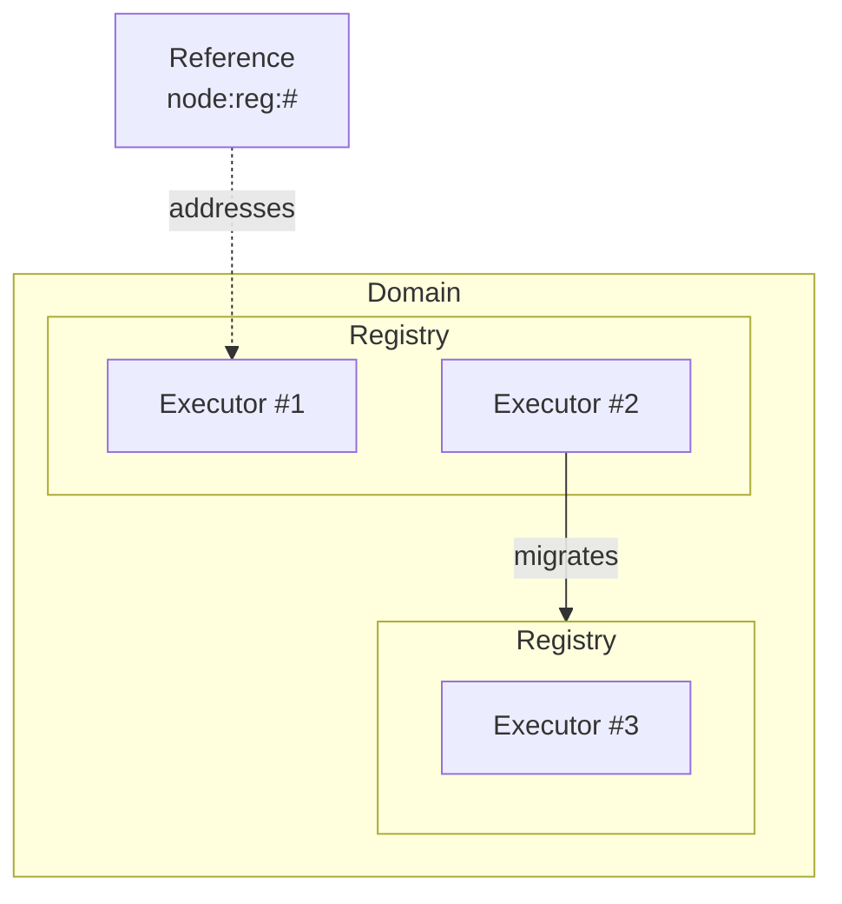
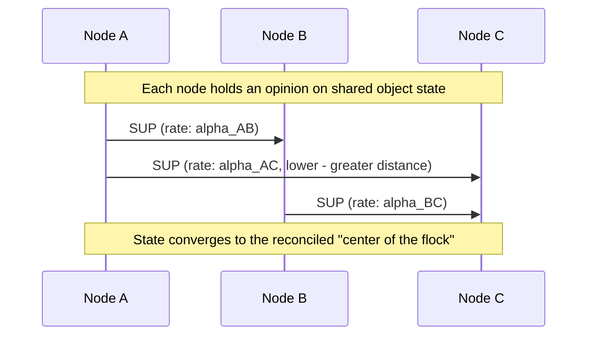
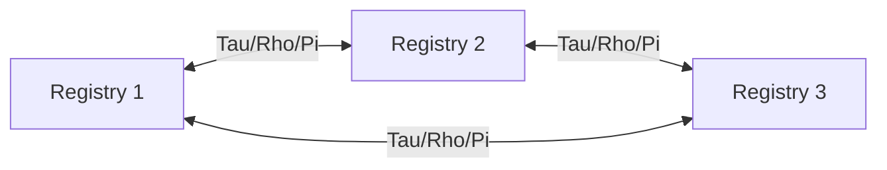

# CppKaiCore Architecture

## Language pipeline

Rho source transpiles to Pi, which the Executor evaluates directly. Tau
generates the Agent/Proxy pairs that make C++ types network-transparent.

## Object model: Registry / Domain / Executor

A Domain is a collection of Registries. Each object is addressed by a
three-part `node:reg:#` scheme, and Executors can migrate between Domains
without breaking existing references.

## Cross-node object consensus (SUP)

Object state is treated as the reconciled "center of the flock" of every
node holding an opinion on it. State Update Packets (SUPs) are pushed at a
frequency that falls off with distance, using a per-node-pair propagation
rate rather than one global constant. Each object tracks a "world-line": a
time-space frame with time kept relative to local flock time.

## Parallelism model

KAI avoids threading within a single Registry. Parallelism instead comes
from running multiple Registries that communicate over Tau/Rho/Pi.

